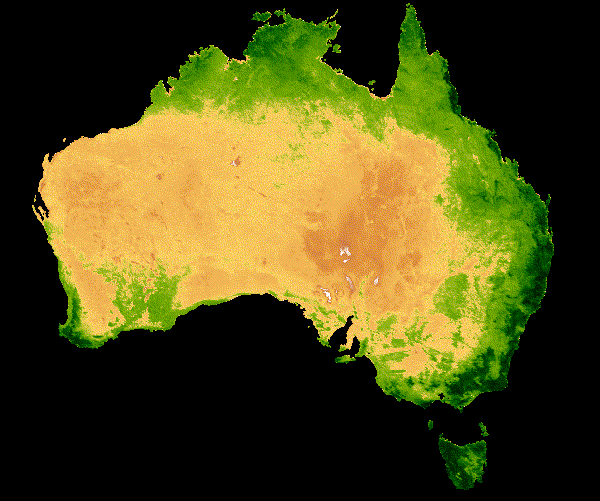

# Call For Code Spot: Australian Wildfires
Elvis C, Shruti Chaturvedi, Divyansh Choubisa, Albert Um

## Objective
The goal for this project is to forecast wildfires in Australia for February 2021. The estimated fire area represents the summation of fire activity in a 1km by 1km region. The Australian regions are 7 states:
- NSW = New South Wales
- NT = Northern Territory
- QL = Queensland
- SA = Southern Australia
- TA = Tasmania
- VI = Victoria
- WA = Western Australia


## Structure of Repository


## Data
The original zip datafile can be retrieved from the code challenge git page; provided [here](https://github.com/Call-for-Code/Spot-Challenge-Wildfires). <br>
The zipped data file includes the following:

```
Nov_10
└───Historical_Wildfires.csv
│   └─── :: Contains data on fire activites in Australi from 2005.
└───HistoricalWeather.csv
│   └─── :: Contains daily aggregates of weather including Precipitation
│        :: Humidty, Soil water content, Solar Radiation, Temperature
│        :: and Wind Speed.
└───HistoricalWeatherForecasts.csv
│   └─── :: Contains forecasted values for weather in 5, 10 or 15 lead times.
└───LandClass.csv
│   └─── :: Contains terrain properties of the 7 regions pulled on 2015.
└───VegetationIndex.csv
    └─── :: Contains monthly vegetation values(min, max, mean, variance) 
         :: for each region
```


The dependent variable for this project is the estimated fire area per region. The area is aggregated per region and is not granulated to the point where I'll be able to plot them geographically. Therefore, we will assume that the fire area is conglomerated into one section of the region. We will also assume the variables regarding weather and vegetation to be uniformly distributed per region. 
(This may not be exactly what we want, and further data collection might be done; please see Further Steps)

We will also assume that natural fires tend to have a life expectancy and don't live perpetually(One tree won't burn until the end of time). However, the real risk is the expansion of fires. For example, although one tree stopped burning, the fire could have expanded to other trees creating a domino effect.

Therefore, the dependent variable during modeling shouldn't be the area but the perimeter, circumference, or surface area of the fire. For this project, we will transform the estimated fire area to a radius by square rooting the estimated fire area:


<!-- The distribution of the radii create a power-law-like or log-like distribution and therefore, I will once again transform the y dependent through log transformation. -->


## Preprocessing

## Model


## Further Steps


