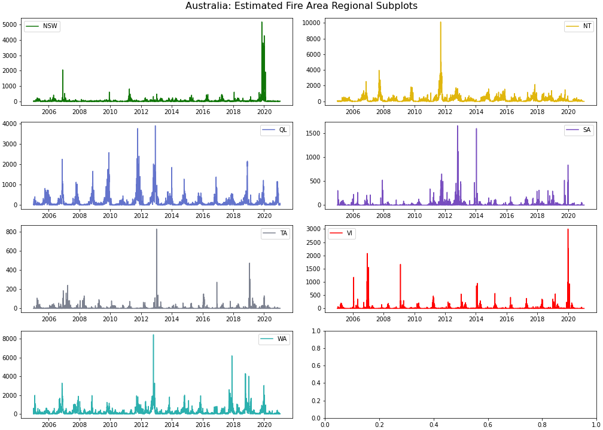
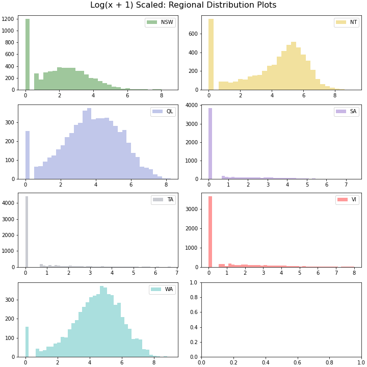
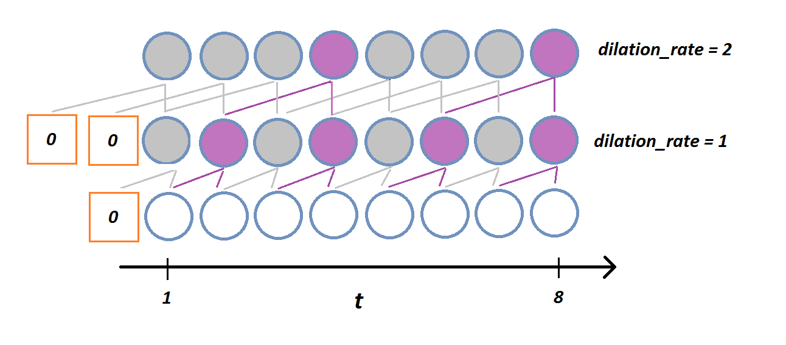

# Call For Code Spot: Australian Wildfires
Elvis C, Shruti Chaturvedi, Divyansh Choubisa, Tiffany Sung, Albert Um

## Objective
The goal of this project is to forecast wildfires in Australia for February 2021. The estimated fire area represents the summation of fire activity in a 1km by 1km region. The Australian 7 regions are:
- NSW = New South Wales
- NT = Northern Territory
- QL = Queensland
- SA = Southern Australia
- TA = Tasmania
- VI = Victoria
- WA = Western Australia

 <br>
credit: https://www.touropia.com/regions-in-australia-map/

## Structure of Repository


## Data
The original zip datafile can be retrieved from the code challenge git page; provided [here](https://github.com/Call-for-Code/Spot-Challenge-Wildfires). <br>
The zipped data file includes the following:

```
Nov_10
└───Historical_Wildfires.csv
│   └─── :: Contains data on fire activites in Australia from 2005.
└───HistoricalWeather.csv
│   └─── :: Contains daily aggregates of weather including Precipitation
│        :: Humidty, Soil water content, Solar Radiation, Temperature
│        :: and Wind Speed.
└───HistoricalWeatherForecasts.csv
│   └─── :: Contains forecasted values for weather in 5, 10 or 15 lead times.
└───LandClass.csv
│   └─── :: Contains terrain properties of the 7 regions pulled on 2015.
└───VegetationIndex.csv
    └─── :: Contains monthly vegetation values(min, max, mean, variance) 
         :: for each region
```
The Historical_Wildfires dataset is based on the MCD14DL dataset (comprised of MOD14AL1/MYD14AL1, which highlights thermal anomalies with a pixel resolution of 1000 meters). The dataset has daily time intervals ranging from 2005-01-01 to 2020-10-31'. The "estimated fire area" was computed by multiplying the scan and track pixel sizes from the MCD14DL. </br>

The pixels from MODIS represent 1km only directly below the satellite, and the scan and track values are calculated due to increasing resolution as the pixels approach the end of the picture. The scan and track represent the spatial resolution east to west and north to south respective. It's important to note that all pixels do not represent 1km in a spatial area, and the resolution increases as the pixels are further away from the center. <br>

Therefore, the estimated area will be higher than the count of pixelated fire derived below:


: https://cdn.earthdata.nasa.gov/conduit/upload/12068/MODIS_fire_ground_observation.png

## Data Exploration



Here I have plotted the daily estimated fire area per region. The land cover area differs for each region, nonetheless, the pattern of daily fire areas are not uniform across all regions.



Like most natural disasters, wildfires often come in power-law like distributions and therefore I log transformed for this plot to see the distributions of each region. This can be quickly interpretted that the distributions of fires are not uniform across the 7 regions.


## Feature Engineering

The dependent variable for this project is the estimated fire area per region. The data statistics are aggregated per region and are not granulated to the point where I'll be able to plot the datapoints geographically. The same thing applies to the weather and vegetation statistics.  Therefore, we will also assume the variables regarding wildfires, weather, and vegetation to be uniformly distributed per region. 
(This may not be exactly what we want, and further data collection might be done; please see Further Steps)

We will also assume that natural fires tend to have a life expectancy and don't live perpetually(One tree won't burn until the end of time). However, the real risk is the expansion of fires. For example, although one tree stopped burning, the fire could have expanded to other trees creating a domino effect.

Therefore, a feature that might be interesting would be involving the perimeter of the fire. Since we do not know the number of geographically separated fires, I will create two features with respective assumptions:
1. Assume the fire is conglomerated into one region and take the square root of the estimated area(leaving out the constants) as a feature.
2. Assume the count of fires are all separated and have equal radius/length/height (No pixel of detected fire will touch another pixel). The feature will be created by square rooting the (fire area/ pixel count) then multiplying the pixel count to get the summation of the perimeters.


In addition, I will include the mean weather data (such as Temperature, Solar Radation, Humidity, Precipitation, Windspeed, etc.) per region and assume each region uniformly has the same mean despite difference in location. I will also include the mean vegetation index per region and assume the region uniformly has the same mean vegetation index per region.


## Preprocessing 
The dataset needed to be clipped to a number of sequences that will eventually be inputted into a CNN with dilation. Instead 

For model validation, I separated 2005-01-01 to 2020-10-31 for my training set and 2020-11-01 to 2021-01-31 for my test set. 

I then windowed the dataset with an input shape of 120 days, 77 variables, and an output shape of 41 days, 7 variables(regions). I  utilized a WaveNet like architecture to sling-shot output 41 days ahead. This would mean that I will assume the forecasted 41 days are not correlated with each other. This might not necessarily be the case, but it still gives some promising results.



I chose a Poisson loss function and used mean percentage error as my metric. On the test set(2020-11-01 to 2021-01-31), I had a mean percentage error of:


## Further Steps
For further steps, I would like to first fit an auto regressive DCNN. For this challenge, I took a simpler approach of sling shotting 41 stesp and I'm curious of how much an improvement the model with an autoregressive element.
In addition, I would like to explore the MODIS14AL1 Thermal Anomalies dataset to have a better understanding of wildfires in a more granulated form. This would require petabytes worth of data, but I believe it can be done using google earth engine. Some of the assumptions that I had to make for this challenge are clearly false given the following

## Conclusions


